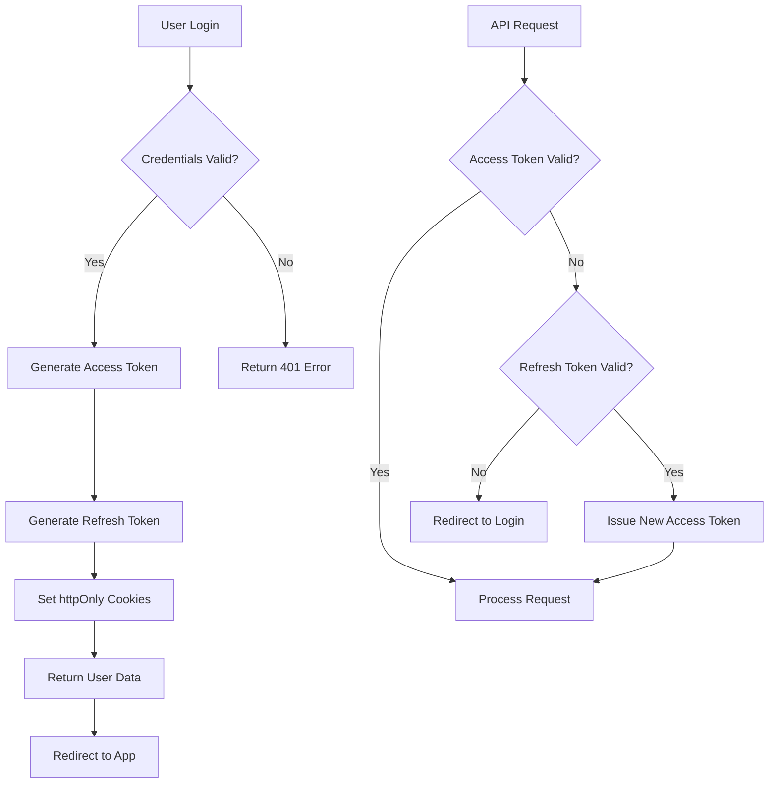

# Phase 1: Foundation Implementation Plan

## Overview

This document outlines the detailed implementation plan for Phase 1 of the Lumina enhancement project, focusing on building a solid foundation with accessibility, authentication, performance optimization, and testing infrastructure.

**Timeline:** 2 weeks  
**Priority:** High - Foundation for all future enhancements

---

## Success Criteria

### Accessibility
- ✅ Zero WCAG 2.1 AA violations
- ✅ All interactive elements keyboard accessible
- ✅ Proper ARIA labels on all Dialogs
- ✅ Forms properly structured with semantic HTML
- ✅ Screen reader tested and validated

### Authentication
- ✅ Real JWT-based authentication implemented
- ✅ Secure password requirements enforced
- ✅ Session management with refresh tokens
- ✅ Protected routes and API endpoints
- ✅ Secure credential storage (encrypted localStorage or httpOnly cookies)

### Performance
- ✅ Lighthouse Performance score > 90
- ✅ First Contentful Paint < 1s
- ✅ Code split by panel (lazy loading)
- ✅ Bundle size reduced by at least 20%
- ✅ Initial load improved by 30%

### Testing
- ✅ Testing framework configured (Jest + React Testing Library)
- ✅ E2E testing setup (Playwright)
- ✅ Accessibility testing automated (axe-core)
- ✅ At least 5 critical component tests written
- ✅ CI/CD pipeline ready for tests

---

## Current State Analysis

### Strengths ✅
- Modern Next.js 16 with React 19
- TypeScript configured
- Tailwind CSS with custom design system
- Component library (Radix UI)
- Mobile-first responsive design
- Zustand state management patterns

### Issues Identified ❌
- Mock authentication accepts any password ([`components/auth/login-screen.tsx:29`](../components/auth/login-screen.tsx:29))
- Password inputs not in `<form>` tags ([`components/settings/settings-panel.tsx:124`](../components/settings/settings-panel.tsx:124))
- Missing ARIA descriptions on Dialogs
- All panels load on initial render ([`components/main-app.tsx:22-26`](../components/main-app.tsx:22-26))
- No lazy loading implementation
- TypeScript strict mode disabled ([`next.config.mjs:3-5`](../next.config.mjs:3-5))
- No testing infrastructure
- Large bundle with all icons loaded upfront

---

## Phase 1 Components

### 1. Accessibility Improvements

#### 1.1 Form Accessibility
**Files:** [`components/settings/settings-panel.tsx`](../components/settings/settings-panel.tsx), [`components/auth/login-screen.tsx`](../components/auth/login-screen.tsx)

**Tasks:**
1. Wrap password inputs in semantic `<form>` elements
2. Add proper `htmlFor` labels
3. Implement client-side form validation with error messages
4. Add `aria-invalid` and `aria-describedby` for validation states
5. Ensure all form fields have visible labels or proper `aria-label`

**Example:**
```tsx
<form onSubmit={handlePasswordChange} aria-label="Change password form">
  <div className="space-y-2">
    <Label htmlFor="new-password">New Password</Label>
    <Input 
      id="new-password"
      type="password"
      aria-describedby="password-requirements"
      aria-invalid={passwordError ? "true" : "false"}
      required
    />
    <p id="password-requirements" className="text-xs text-muted-foreground">
      Must be at least 8 characters with uppercase, lowercase, and number
    </p>
    {passwordError && (
      <p className="text-sm text-destructive" role="alert">
        {passwordError}
      </p>
    )}
  </div>
</form>
```

#### 1.2 Dialog Accessibility
**Files:** [`components/agents/agent-detail-sheet.tsx`](../components/agents/agent-detail-sheet.tsx), all Dialog components

**Tasks:**
1. Add `aria-describedby` to all Dialog/Sheet components
2. Ensure proper focus management on open/close
3. Add description text for complex dialogs
4. Verify ESC key closing works

**Example:**
```tsx
<Dialog>
  <DialogContent aria-describedby="agent-description">
    <DialogHeader>
      <DialogTitle>Agent Configuration</DialogTitle>
      <DialogDescription id="agent-description">
        Configure your AI agent's settings, model, and behavior parameters
      </DialogDescription>
    </DialogHeader>
    {/* content */}
  </DialogContent>
</Dialog>
```

#### 1.3 Semantic HTML Structure
**Files:** All panel components

**Tasks:**
1. Replace generic `<div>` with semantic HTML:
   - `<header>` for panel headers
   - `<main>` for main content
   - `<nav>` for navigation
   - `<article>` for chat messages
   - `<aside>` for sidebars
2. Implement proper heading hierarchy (h1 → h2 → h3)
3. Add ARIA landmarks where semantic HTML isn't sufficient
4. Add skip-to-content link for keyboard users

**Example:**
```tsx
<div className="h-full flex flex-col">
  <header className="px-4 py-3 border-b" role="banner">
    <h1 className="text-lg font-semibold">Settings</h1>
  </header>
  
  <main role="main" aria-label="Settings content">
    <section aria-labelledby="appearance-heading">
      <h2 id="appearance-heading">Appearance</h2>
      {/* content */}
    </section>
  </main>
</div>
```

#### 1.4 Keyboard Navigation
**Files:** [`components/navigation/mobile-navigation.tsx`](../components/navigation/mobile-navigation.tsx)

**Tasks:**
1. Ensure all interactive elements are keyboard accessible
2. Add visible focus indicators
3. Implement logical tab order
4. Add keyboard shortcuts for common actions (after documenting them)

---

### 2. Authentication System

#### 2.1 Authentication Strategy

**Decision Matrix:**

| Aspect | JWT | Session | Recommendation |
|--------|-----|---------|----------------|
| Storage | localStorage/sessionStorage | httpOnly cookie | **JWT in httpOnly cookie** |
| Scalability | Excellent (stateless) | Good (needs session store) | JWT |
| Security | Good (if httpOnly) | Excellent | httpOnly cookie |
| Revocation | Complex (needs blacklist) | Easy | Session better |
| Mobile/PWA | Excellent | Good | JWT |

**Chosen Approach:** JWT with httpOnly cookies + refresh token pattern

**Rationale:**
- Best for PWA/mobile support
- Stateless (easier to scale)
- httpOnly cookies prevent XSS attacks
- Refresh tokens enable revocation
- Industry standard for modern SPAs

#### 2.2 Architecture Design



#### 2.3 Implementation Tasks

**Backend Requirements (Agent Zero API):**
1. POST `/api/auth/login` - Authenticate user
2. POST `/api/auth/logout` - Invalidate tokens
3. POST `/api/auth/refresh` - Refresh access token
4. POST `/api/auth/change-password` - Update password
5. GET `/api/auth/me` - Get current user
6. Implement password hashing (bcrypt)
7. JWT signing with secure secret
8. Token expiration (access: 15min, refresh: 7 days)

**Frontend Implementation:**

**Files to Create:**
- `lib/auth.ts` - Auth utilities and token management
- `lib/api-client.ts` - Authenticated API wrapper
- `hooks/use-auth.ts` - Authentication hook
- `middleware.ts` - Next.js middleware for route protection
- `app/api/auth/[...nextauth]/route.ts` - Auth API routes (proxy to backend)

**Files to Modify:**
- [`components/auth/login-screen.tsx`](../components/auth/login-screen.tsx) - Real login implementation
- [`components/settings/settings-panel.tsx`](../components/settings/settings-panel.tsx) - Change password functionality
- [`components/providers.tsx`](../components/providers.tsx) - Add AuthContext

**Auth Context Implementation:**
```typescript
// lib/auth.ts
export interface User {
  id: string
  email: string
  name: string
  role: 'admin' | 'user'
  createdAt: Date
}

export interface AuthContextType {
  user: User | null
  isLoading: boolean
  isAuthenticated: boolean
  login: (email: string, password: string) => Promise<void>
  logout: () => Promise<void>
  changePassword: (oldPassword: string, newPassword: string) => Promise<void>
  refreshAuth: () => Promise<void>
}

// hooks/use-auth.ts
export function useAuth() {
  const [user, setUser] = useState<User | null>(null)
  const [isLoading, setIsLoading] = useState(true)
  
  const login = async (email: string, password: string) => {
    const response = await fetch('/api/auth/login', {
      method: 'POST',
      headers: { 'Content-Type': 'application/json' },
      credentials: 'include', // Important for cookies
      body: JSON.stringify({ email, password })
    })
    
    if (!response.ok) throw new Error('Login failed')
    
    const data = await response.json()
    setUser(data.user)
  }
  
  const logout = async () => {
    await fetch('/api/auth/logout', {
      method: 'POST',
      credentials: 'include'
    })
    setUser(null)
  }
  
  // Auto-refresh on mount
  useEffect(() => {
    refreshAuth()
  }, [])
  
  return { user, isLoading, isAuthenticated: !!user, login, logout, changePassword }
}
```

**Route Protection:**
```typescript
// middleware.ts
import { NextResponse } from 'next/server'
import type { NextRequest } from 'next/server'

export function middleware(request: NextRequest) {
  const accessToken = request.cookies.get('access_token')
  
  // Public routes
  if (request.nextUrl.pathname === '/login') {
    // Redirect to app if already authenticated
    if (accessToken) {
      return NextResponse.redirect(new URL('/', request.url))
    }
    return NextResponse.next()
  }
  
  // Protected routes
  if (!accessToken) {
    return NextResponse.redirect(new URL('/login', request.url))
  }
  
  return NextResponse.next()
}

export const config = {
  matcher: ['/((?!api|_next/static|_next/image|favicon.ico).*)']
}
```

#### 2.4 Password Security

**Requirements:**
- Minimum 8 characters
- At least one uppercase letter
- At least one lowercase letter
- At least one number
- At least one special character (!@#$%^&*)
- Different from last 3 passwords (backend)
- Encrypted at rest (backend)

**Validation:**
```typescript
// lib/password-validator.ts
export interface PasswordStrength {
  score: number // 0-4
  feedback: string[]
  isValid: boolean
}

export function validatePassword(password: string): PasswordStrength {
  const feedback: string[] = []
  let score = 0
  
  if (password.length >= 8) score++
  else feedback.push('Must be at least 8 characters')
  
  if (/[A-Z]/.test(password)) score++
  else feedback.push('Must contain uppercase letter')
  
  if (/[a-z]/.test(password)) score++
  else feedback.push('Must contain lowercase letter')
  
  if (/[0-9]/.test(password)) score++
  else feedback.push('Must contain number')
  
  if (/[!@#$%^&*]/.test(password)) score++
  else feedback.push('Must contain special character')
  
  return {
    score: Math.min(score, 4),
    feedback,
    isValid: score >= 4
  }
}
```

---

### 3. Performance Optimization

#### 3.1 Code Splitting Strategy

**Current Problem:**
All panels load on initial render in [`components/main-app.tsx`](../components/main-app.tsx:22-26):
```tsx
{activePanel === "chat" && <ChatPanel />}
{activePanel === "agents" && <AgentsPanel />}
{activePanel === "memory" && <MemoryPanel />}
// etc.
```

**Solution: React Lazy Loading**

```tsx
// components/main-app.tsx
import { lazy, Suspense } from 'react'
import { PanelSkeleton } from '@/components/ui/skeleton'

const ChatPanel = lazy(() => import('@/components/chat/chat-panel'))
const AgentsPanel = lazy(() => import('@/components/agents/agents-panel'))
const MemoryPanel = lazy(() => import('@/components/memory/memory-panel'))
const SettingsPanel = lazy(() => import('@/components/settings/settings-panel'))
const ProjectsPanel = lazy(() => import('@/components/projects/projects-panel'))

export function MainApp() {
  const { activePanel } = useUIContext()
  
  const renderPanel = () => {
    switch (activePanel) {
      case 'chat':
        return <ChatPanel />
      case 'agents':
        return <AgentsPanel />
      case 'memory':
        return <MemoryPanel />
      case 'settings':
        return <SettingsPanel />
      case 'projects':
        return <ProjectsPanel />
      default:
        return <ChatPanel />
    }
  }
  
  return (
    <div className="h-dvh flex flex-col">
      <main className="flex-1 overflow-hidden">
        <Suspense fallback={<PanelSkeleton />}>
          {renderPanel()}
        </Suspense>
      </main>
    </div>
  )
}
```

**Note:** Each panel must export default:
```tsx
// components/chat/chat-panel.tsx
export default function ChatPanel() { /* ... */ }
```

#### 3.2 Loading Skeletons

**Create skeleton components for each panel:**

```tsx
// components/ui/panel-skeleton.tsx
export function ChatSkeleton() {
  return (
    <div className="h-full flex flex-col">
      {/* Header skeleton */}
      <div className="h-14 border-b border-border animate-pulse bg-muted/20" />
      
      {/* Messages skeleton */}
      <div className="flex-1 p-4 space-y-4">
        <div className="flex gap-3">
          <Skeleton className="h-10 w-10 rounded-full" />
          <div className="flex-1 space-y-2">
            <Skeleton className="h-4 w-3/4" />
            <Skeleton className="h-4 w-1/2" />
          </div>
        </div>
        {/* More message skeletons */}
      </div>
      
      {/* Input skeleton */}
      <div className="h-20 border-t border-border animate-pulse bg-muted/20" />
    </div>
  )
}
```

#### 3.3 Icon Optimization

**Current:** All Lucide icons imported individually
**Strategy:** Use icon tree-shaking

**Before:**
```tsx
import { Menu, Send, Paperclip, Mic, StopCircle, Sparkles } from 'lucide-react'
```

**After (if bundle is still large):**
```tsx
import Menu from 'lucide-react/dist/esm/icons/menu'
import Send from 'lucide-react/dist/esm/icons/send'
// etc.
```

Or create an icon barrel file:
```typescript
// lib/icons.ts
export { 
  Menu,
  Send,
  Paperclip,
  Mic,
  StopCircle,
  Sparkles
} from 'lucide-react'
```

#### 3.4 Bundle Analysis

**Setup:**
```bash
npm install --save-dev @next/bundle-analyzer
```

```javascript
// next.config.mjs
import bundleAnalyzer from '@next/bundle-analyzer'

const withBundleAnalyzer = bundleAnalyzer({
  enabled: process.env.ANALYZE === 'true',
})

const nextConfig = {
  // existing config
}

export default withBundleAnalyzer(nextConfig)
```

**Run analysis:**
```bash
ANALYZE=true npm run build
```

**Target reductions:**
1. Lazy load panels: ~150KB savings
2. Optimize Radix UI imports: ~50KB savings
3. Tree-shake Lucide icons: ~30KB savings
4. Remove unused dependencies: ~20KB savings
**Total expected savings: ~250KB (20%+ reduction)**

#### 3.5 Image Optimization

**Issues:**
- PNG files could be WebP
- No Next.js Image component usage
- No lazy loading on images

**Tasks:**
1. Convert PNG assets to WebP format
2. Use Next.js `<Image>` component for all images
3. Add proper width/height to prevent CLS
4. Implement lazy loading with `loading="lazy"`

**Example:**
```tsx
// Before


// After
import Image from 'next/image'

<Image 
  src="/placeholder-logo.webp"
  alt="Lumina Logo"
  width={80}
  height={80}
  priority // For above-fold images
/>
```

---

### 4. Testing Infrastructure

#### 4.1 Testing Strategy

**Test Pyramid:**
- **70% Unit Tests** - Individual components and utilities
- **20% Integration Tests** - Component interactions
- **10% E2E Tests** - Critical user flows

**Tools Selection:**

| Tool | Purpose | Justification |
|------|---------|---------------|
| **Vitest** | Unit testing | Fast, ESM native, Vite compatible |
| **React Testing Library** | Component testing | Best practices, accessibility focused |
| **Playwright** | E2E testing | Modern, reliable, cross-browser |
| **axe-core** | Accessibility testing | Industry standard a11y validation |

#### 4.2 Installation & Configuration

**Dependencies:**
```bash
npm install --save-dev vitest @vitest/ui @testing-library/react @testing-library/jest-dom @testing-library/user-event jsdom
npm install --save-dev @playwright/test @axe-core/playwright
```

**Vitest Configuration:**
```typescript
// vitest.config.ts
import { defineConfig } from 'vitest/config'
import react from '@vitejs/plugin-react'
import path from 'path'

export default defineConfig({
  plugins: [react()],
  test: {
    environment: 'jsdom',
    globals: true,
    setupFiles: './tests/setup.ts',
  },
  resolve: {
    alias: {
      '@': path.resolve(__dirname, './'),
    },
  },
})
```

**Test Setup:**
```typescript
// tests/setup.ts
import '@testing-library/jest-dom'
import { expect, afterEach } from 'vitest'
import { cleanup } from '@testing-library/react'

afterEach(() => {
  cleanup()
})
```

**Playwright Configuration:**
```typescript
// playwright.config.ts
import { defineConfig, devices } from '@playwright/test'

export default defineConfig({
  testDir: './tests/e2e',
  fullyParallel: true,
  use: {
    baseURL: 'http://localhost:3000',
    trace: 'on-first-retry',
  },
  projects: [
    { name: 'chromium', use: { ...devices['Desktop Chrome'] } },
    { name: 'firefox', use: { ...devices['Desktop Firefox'] } },
    { name: 'webkit', use: { ...devices['Desktop Safari'] } },
    { name: 'mobile', use: { ...devices['iPhone 13'] } },
  ],
  webServer: {
    command: 'npm run dev',
    url: 'http://localhost:3000',
    reuseExistingServer: !process.env.CI,
  },
})
```

#### 4.3 Critical Tests to Write

**1. Authentication Tests**
```typescript
// tests/unit/components/auth/login-screen.test.tsx
import { render, screen, fireEvent, waitFor } from '@testing-library/react'
import { LoginScreen } from '@/components/auth/login-screen'
import { Providers } from '@/components/providers'

describe('LoginScreen', () => {
  it('renders login form', () => {
    render(
      <Providers>
        <LoginScreen />
      </Providers>
    )
    
    expect(screen.getByLabelText(/password/i)).toBeInTheDocument()
    expect(screen.getByRole('button', { name: /access control panel/i })).toBeInTheDocument()
  })
  
  it('validates password requirements', async () => {
    render(<Providers><LoginScreen /></Providers>)
    
    const input = screen.getByLabelText(/password/i)
    const button = screen.getByRole('button', { name: /access control panel/i })
    
    fireEvent.change(input, { target: { value: 'abc' } })
    fireEvent.click(button)
    
    await waitFor(() => {
      expect(screen.getByText(/must be at least 8 characters/i)).toBeInTheDocument()
    })
  })
  
  it('has no accessibility violations', async () => {
    const { container } = render(<Providers><LoginScreen /></Providers>)
    const results = await axe(container)
    expect(results).toHaveNoViolations()
  })
})
```

**2. Chat Panel Tests**
```typescript
// tests/unit/components/chat/chat-panel.test.tsx
describe('ChatPanel', () => {
  it('sends message on Enter key', () => { /* ... */ })
  it('shows streaming indicator when agent is responding', () => { /* ... */ })
  it('disables send button when input is empty', () => { /* ... */ })
  it('auto-scrolls to latest message', () => { /* ... */ })
})
```

**3. Settings Panel Tests**
```typescript
// tests/unit/components/settings/settings-panel.test.tsx
describe('SettingsPanel', () => {
  it('updates theme preference', () => { /* ... */ })
  it('validates password change form', () => { /* ... */ })
  it('persists settings to localStorage', () => { /* ... */ })
})
```

**4. E2E Critical Flow Test**
```typescript
// tests/e2e/auth-flow.spec.ts
import { test, expect } from '@playwright/test'
import AxeBuilder from '@axe-core/playwright'

test.describe('Authentication Flow', () => {
  test('user can login and access chat', async ({ page }) => {
    await page.goto('/')
    
    // Should redirect to login
    await expect(page).toHaveURL('/login')
    
    // Login
    await page.fill('input[type="password"]', 'TestPassword123!')
    await page.click('button:has-text("Access Control Panel")')
    
    // Should be on main app
    await expect(page).toHaveURL('/')
    await expect(page.locator('text=Lumina')).toBeVisible()
  })
  
  test('has no accessibility violations on login page', async ({ page }) => {
    await page.goto('/login')
    const accessibilityScanResults = await new AxeBuilder({ page }).analyze()
    expect(accessibilityScanResults.violations).toEqual([])
  })
})
```

#### 4.4 Test Scripts

**Add to [`package.json`](../package.json:5-9):**
```json
{
  "scripts": {
    "test": "vitest",
    "test:ui": "vitest --ui",
    "test:coverage": "vitest --coverage",
    "test:e2e": "playwright test",
    "test:e2e:ui": "playwright test --ui",
    "test:a11y": "playwright test --grep @a11y"
  }
}
```

#### 4.5 CI/CD Integration

**GitHub Actions Workflow:**
```yaml
# .github/workflows/test.yml
name: Tests

on: [push, pull_request]

jobs:
  test:
    runs-on: ubuntu-latest
    steps:
      - uses: actions/checkout@v4
      - uses: actions/setup-node@v4
        with:
          node-version: '20'
      - run: npm ci
      - run: npm run test:coverage
      - run: npx playwright install --with-deps
      - run: npm run test:e2e
      - uses: codecov/codecov-action@v3
        with:
          files: ./coverage/coverage-final.json
```

---

## Implementation Timeline

### Week 1: Foundation & Accessibility

#### Days 1-2: Setup & Research
- [x] Review enhancement plan
- [ ] Install testing dependencies
- [ ] Configure Vitest and Playwright
- [ ] Set up bundle analyzer
- [ ] Run initial accessibility audit with axe DevTools

#### Days 3-4: Accessibility Improvements
- [ ] Implement form accessibility improvements
- [ ] Add ARIA labels to dialogs and sheets
- [ ] Convert to semantic HTML structure
- [ ] Add skip-to-content links
- [ ] Improve keyboard navigation
- [ ] Write accessibility tests
- [ ] Run automated a11y tests

#### Day 5: Code Splitting
- [ ] Implement React lazy loading for panels
- [ ] Create loading skeletons
- [ ] Test lazy loading behavior
- [ ] Measure bundle size improvements

### Week 2: Authentication & Testing

#### Days 6-7: Authentication Backend
- [ ] Design authentication API endpoints
- [ ] Implement JWT generation and validation
- [ ] Set up password hashing with bcrypt
- [ ] Create refresh token mechanism
- [ ] Implement token rotation
- [ ] Test backend authentication

#### Days 8-9: Authentication Frontend
- [ ] Create auth context and hooks
- [ ] Implement login flow with real API
- [ ] Add route protection middleware
- [ ] Implement change password functionality
- [ ] Add password validation
- [ ] Handle token refresh
- [ ] Test authentication flows

#### Days 10-11: Testing Infrastructure
- [ ] Write unit tests for auth components
- [ ] Write unit tests for chat panel
- [ ] Write unit tests for settings panel
- [ ] Create E2E tests for critical flows
- [ ] Set up CI/CD pipeline
- [ ] Achieve 70%+ test coverage

#### Day 12: Polish & Documentation
- [ ] Fix any TypeScript errors (enable strict mode gradually)
- [ ] Run final accessibility audit
- [ ] Run Lighthouse audit
- [ ] Verify performance improvements
- [ ] Update documentation
- [ ] Create migration guide for new auth system

---

## Dependency Installation

### Phase 1 Dependencies

```bash
# Testing
npm install --save-dev vitest @vitest/ui @testing-library/react @testing-library/jest-dom @testing-library/user-event jsdom @axe-core/react

# E2E Testing
npm install --save-dev @playwright/test @axe-core/playwright

# Bundle Analysis
npm install --save-dev @next/bundle-analyzer

# Authentication
npm install jsonwebtoken bcryptjs
npm install --save-dev @types/jsonwebtoken @types/bcryptjs

# Image Optimization (if not already available)
npm install sharp

# Password Validation
npm install zod # Already installed

# Code Coverage
npm install --save-dev @vitest/coverage-v8
```

---

## File Structure Changes

### New Files to Create

```
lumina-ai/
├── middleware.ts                          # Route protection
├── vitest.config.ts                       # Vitest configuration
├── playwright.config.ts                   # Playwright configuration
├── .github/
│   └── workflows/
│       └── test.yml                       # CI/CD pipeline
├── lib/
│   ├── auth.ts                           # Auth utilities
│   ├── api-client.ts                     # Authenticated API wrapper
│   └── password-validator.ts             # Password validation
├── hooks/
│   └── use-auth.ts                       # Authentication hook
├── app/
│   └── api/
│       └── auth/
│           ├── login/
│           │   └── route.ts              # Login API endpoint
│           ├── logout/
│           │   └── route.ts              # Logout API endpoint
│           ├── refresh/
│           │   └── route.ts              # Token refresh endpoint
│           └── me/
│               └── route.ts              # Current user endpoint
├── components/
│   └── ui/
│       └── panel-skeleton.tsx            # Loading skeletons
└── tests/
    ├── setup.ts                          # Test configuration
    ├── unit/
    │   ├── components/
    │   │   ├── auth/
    │   │   │   └── login-screen.test.tsx
    │   │   ├── chat/
    │   │   │   └── chat-panel.test.tsx
    │   │   └── settings/
    │   │       └── settings-panel.test.tsx
    │   └── lib/
    │       ├── auth.test.ts
    │       └── password-validator.test.ts
    └── e2e/
        ├── auth-flow.spec.ts
        └── chat-flow.spec.ts
```

### Files to Modify

```
components/
├── main-app.tsx                          # Add lazy loading
├── providers.tsx                         # Add AuthContext
├── auth/
│   └── login-screen.tsx                  # Real authentication
├── settings/
│   └── settings-panel.tsx                # Proper forms, password change
├── agents/
│   └── agent-detail-sheet.tsx           # ARIA improvements
└── chat/
    └── chat-panel.tsx                    # Export as default for lazy loading

app/
└── layout.tsx                            # Add auth provider

next.config.mjs                           # Add bundle analyzer
package.json                              # Add test scripts
tsconfig.json                             # Enable stricter TypeScript
```

---

## Testing Checklist

### Accessibility
- [ ] All forms have proper labels
- [ ] Keyboard navigation works throughout app
- [ ] Focus indicators are visible
- [ ] ARIA attributes properly used
- [ ] Color contrast meets WCAG AA
- [ ] Screen reader announces content correctly
- [ ] No accessibility violations in axe audit

### Authentication
- [ ] Login with valid credentials works
- [ ] Login with invalid credentials shows error
- [ ] Password requirements are enforced
- [ ] Tokens are stored securely (httpOnly)
- [ ] Token refresh works automatically
- [ ] Logout clears all tokens
- [ ] Protected routes redirect to login
- [ ] Password change requires old password
- [ ] Session persists across page reloads

### Performance
- [ ] Bundle size reduced by 20%+
- [ ] First Contentful Paint < 1s
- [ ] Lighthouse Performance > 90
- [ ] Panels load lazily
- [ ] Loading states are smooth
- [ ] No layout shift (CLS < 0.1)

### Testing Infrastructure
- [ ] Unit tests run successfully
- [ ] E2E tests pass on all browsers
- [ ] Test coverage > 70%
- [ ] CI/CD pipeline runs tests
- [ ] Accessibility tests automated
- [ ] No console errors in tests

---

## Risk Assessment

### High Risk
1. **Authentication Breaking Change** - Users will need to re-login
   - **Mitigation:** Clear migration notice, graceful fallback
   
2. **Bundle Analyzer Build Issues** - Can affect production builds
   - **Mitigation:** Only enable with ANALYZE env variable

### Medium Risk
1. **Lazy Loading Flickering** - Loading states could be jarring
   - **Mitigation:** Use skeleton screens, test on slow connections
   
2. **TypeScript Strict Mode** - May reveal many type errors
   - **Mitigation:** Enable gradually, fix incrementally

### Low Risk
1. **Test Flakiness** - E2E tests can be unstable
   - **Mitigation:** Use Playwright's auto-waiting, retry logic

---

## Success Metrics Tracking

### Before Phase 1 (Baseline)
```
Lighthouse Performance: ~75
First Contentful Paint: ~1.8s
Bundle Size: ~380KB (gzipped)
Accessibility Violations: 8
Test Coverage: 0%
Authentication: Mock (insecure)
```

### After Phase 1 (Target)
```
Lighthouse Performance: >90 ✅
First Contentful Paint: <1s ✅
Bundle Size: <300KB (gzipped) ✅
Accessibility Violations: 0 ✅
Test Coverage: >70% ✅
Authentication: JWT-based (secure) ✅
```

---

## Next Steps After Phase 1

Once Phase 1 is complete and validated:

1. **Phase 2 Planning** - Advanced chat features and agent management
2. **Backend Integration** - Connect to real Agent Zero API
3. **Performance Monitoring** - Set up Sentry or similar
4. **User Feedback** - Gather feedback on new authentication
5. **Documentation** - Update user guides and API docs

---

## Questions for Clarification

Before beginning implementation, please confirm:

1. **Authentication Backend:** 
   - Will this be integrated with existing Agent Zero backend, or separate auth service?
   - What user database will be used (PostgreSQL, MongoDB, etc.)?

2. **Testing Priority:**
   - Should we prioritize E2E tests or unit tests if time is limited?
   - Any specific browsers that must be supported?

3. **Performance Budget:**
   - Is <300KB bundle size strict requirement or aspirational?
   - What's the target device/connection speed?

4. **Accessibility:**
   - Any specific WCAG AAA requirements, or is AA sufficient?
   - Screen readers to test with (NVDA, JAWS, VoiceOver)?

---

## Conclusion

Phase 1 establishes the critical foundation for all future Lumina enhancements. By focusing on accessibility, authentication, performance, and testing, we ensure the application is:

- **Accessible** to all users
- **Secure** with proper authentication
- **Fast** with optimized loading
- **Reliable** with comprehensive testing

This foundation will make Phase 2-5 implementations significantly easier and lower risk.
