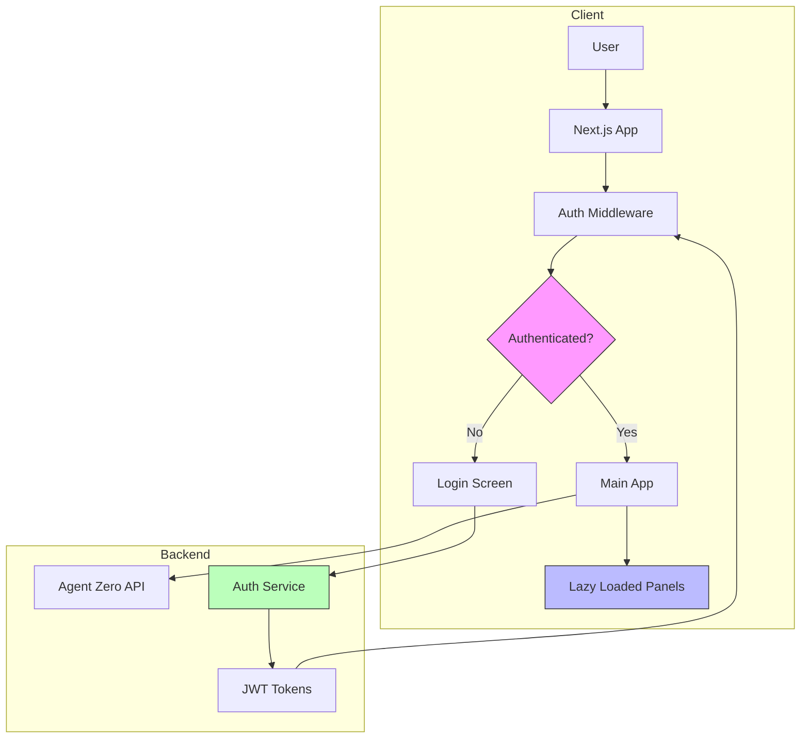

# Phase 1: Quick Reference Guide

## 🎯 Overview

Phase 1 focuses on building a solid foundation with 4 key areas:
1. **Accessibility** - WCAG 2.1 AA compliance
2. **Authentication** - JWT-based secure auth
3. **Performance** - Code splitting & optimization
4. **Testing** - Comprehensive test coverage

**Timeline:** 2 weeks  
**Success Target:** Lighthouse > 90, Zero a11y violations, 70% test coverage

---

## 🏗️ Architecture Overview



---

## 📋 Implementation Checklist

### Week 1: Foundation (Days 1-5)

#### Day 1-2: Setup
- [ ] Install all dependencies
- [ ] Configure Vitest and Playwright
- [ ] Set up bundle analyzer
- [ ] Run baseline metrics

#### Day 3-4: Accessibility
- [ ] Fix forms in settings panel
- [ ] Add ARIA labels to dialogs
- [ ] Convert to semantic HTML
- [ ] Improve keyboard navigation
- [ ] Write a11y tests

#### Day 5: Performance
- [ ] Implement lazy loading
- [ ] Create loading skeletons
- [ ] Run bundle analysis

### Week 2: Auth & Testing (Days 6-12)

#### Day 6-7: Auth Backend
- [ ] Create auth API endpoints
- [ ] Implement JWT signing
- [ ] Set up password hashing
- [ ] Add token refresh

#### Day 8-9: Auth Frontend
- [ ] Create auth context
- [ ] Implement login flow
- [ ] Add route protection
- [ ] Password validation

#### Day 10-11: Testing
- [ ] Write unit tests
- [ ] Write E2E tests
- [ ] Set up CI/CD

#### Day 12: Polish
- [ ] Run audits
- [ ] Fix issues
- [ ] Update docs

---

## 🔧 Key Technologies

| Category | Tool | Purpose |
|----------|------|---------|
| Testing | Vitest | Unit tests |
| Testing | Playwright | E2E tests |
| Testing | axe-core | A11y testing |
| Auth | JWT | Token-based auth |
| Auth | bcrypt | Password hashing |
| Performance | React.lazy | Code splitting |
| Analysis | bundle-analyzer | Bundle optimization |

---

## 📁 New Files to Create

```
High Priority:
├── middleware.ts                    # Route protection
├── vitest.config.ts                 # Test config
├── playwright.config.ts             # E2E config
├── lib/auth.ts                      # Auth utilities
├── hooks/use-auth.ts                # Auth hook
└── tests/
    ├── setup.ts                     # Test setup
    ├── unit/                        # Unit tests
    └── e2e/                         # E2E tests

Medium Priority:
├── lib/password-validator.ts        # Password rules
├── lib/api-client.ts               # API wrapper
├── components/ui/panel-skeleton.tsx # Loading states
└── app/api/auth/                   # Auth endpoints
```

---

## 🎨 Code Snippets

### 1. Lazy Loading Implementation

```tsx
// components/main-app.tsx
import { lazy, Suspense } from 'react'

const ChatPanel = lazy(() => import('./chat/chat-panel'))
const AgentsPanel = lazy(() => import('./agents/agents-panel'))

export function MainApp() {
  return (
    <Suspense fallback={<PanelSkeleton />}>
      {renderPanel()}
    </Suspense>
  )
}
```

### 2. Authentication Hook

```tsx
// hooks/use-auth.ts
export function useAuth() {
  const login = async (email: string, password: string) => {
    const res = await fetch('/api/auth/login', {
      method: 'POST',
      credentials: 'include',
      body: JSON.stringify({ email, password })
    })
    // Handle response
  }
  
  return { user, login, logout, isAuthenticated }
}
```

### 3. Route Protection

```tsx
// middleware.ts
export function middleware(request: NextRequest) {
  const token = request.cookies.get('access_token')
  
  if (!token && !isPublicRoute(request.nextUrl.pathname)) {
    return NextResponse.redirect(new URL('/login', request.url))
  }
  
  return NextResponse.next()
}
```

### 4. Accessibility Improvement

```tsx
// Before
<Input type="password" placeholder="New password" />

// After
<form onSubmit={handlePasswordChange}>
  <Label htmlFor="new-password">New Password</Label>
  <Input 
    id="new-password"
    type="password"
    aria-describedby="password-requirements"
    aria-invalid={error ? "true" : "false"}
    required
  />
  <p id="password-requirements" className="text-xs">
    Must be at least 8 characters
  </p>
</form>
```

### 5. Basic Unit Test

```tsx
// tests/unit/components/auth/login-screen.test.tsx
import { render, screen } from '@testing-library/react'
import { LoginScreen } from '@/components/auth/login-screen'

describe('LoginScreen', () => {
  it('renders login form', () => {
    render(<LoginScreen />)
    expect(screen.getByLabelText(/password/i)).toBeInTheDocument()
  })
})
```

---

## 🚀 Commands Reference

```bash
# Development
npm run dev

# Testing
npm run test              # Run unit tests
npm run test:ui           # Test UI
npm run test:e2e          # E2E tests
npm run test:e2e:ui       # E2E UI mode
npm run test:coverage     # Coverage report

# Analysis
ANALYZE=true npm run build  # Bundle analysis

# Build
npm run build
npm run start
```

---

## 📊 Success Metrics

### Before Phase 1
| Metric | Current | Target |
|--------|---------|--------|
| Lighthouse Performance | ~75 | >90 |
| First Contentful Paint | ~1.8s | <1s |
| Bundle Size (gzipped) | ~380KB | <300KB |
| Accessibility Violations | 8 | 0 |
| Test Coverage | 0% | >70% |
| Auth Security | Mock | JWT |

---

## ⚠️ Common Pitfalls

1. **Lazy Loading Flicker**
   - Use proper loading skeletons
   - Test on slow connections

2. **TypeScript Strict Mode**
   - Enable gradually
   - Fix errors incrementally

3. **E2E Test Flakiness**
   - Use Playwright auto-waiting
   - Add proper selectors

4. **Auth Token Storage**
   - Use httpOnly cookies (not localStorage)
   - Implement token refresh

5. **Bundle Size Regression**
   - Monitor with bundle analyzer
   - Review large dependencies

---

## 🔍 Accessibility Checklist

- [ ] All forms have labels
- [ ] Keyboard navigation works
- [ ] Focus indicators visible
- [ ] ARIA attributes correct
- [ ] Color contrast WCAG AA
- [ ] Screen reader compatible
- [ ] Skip links present
- [ ] Heading hierarchy logical

---

## 🔐 Security Checklist

- [ ] Passwords hashed with bcrypt
- [ ] JWT stored in httpOnly cookies
- [ ] CSRF protection enabled
- [ ] Password requirements enforced
- [ ] Token expiration set
- [ ] Refresh token rotation
- [ ] Secure password reset flow
- [ ] SQL injection prevention

---

## 🧪 Testing Strategy

```
Test Pyramid:
    /\
   /E2\    10% - E2E (Critical flows)
  /----\
 /Integ\ 20% - Integration (Component interactions)
/-------\
| Unit  | 70% - Unit (Components, utilities)
---------
```

**Priority Tests:**
1. Authentication flow (E2E)
2. Login component (Unit)
3. Chat sending (Integration)
4. Settings persistence (Unit)
5. Accessibility (All levels)

---

## 📞 Support & Resources

- [Next.js Docs](https://nextjs.org/docs)
- [Vitest Guide](https://vitest.dev/guide/)
- [Playwright Docs](https://playwright.dev/docs/intro)
- [WCAG Guidelines](https://www.w3.org/WAI/WCAG21/quickref/)
- [JWT Best Practices](https://tools.ietf.org/html/rfc8725)

---

## 🎯 Next Steps

After Phase 1 completion:
1. Review metrics vs targets
2. Gather user feedback
3. Plan Phase 2 (Core Features)
4. Document lessons learned
5. Update enhancement roadmap

---

**Ready to implement? Switch to Code mode and start with Week 1, Day 1 tasks!**
