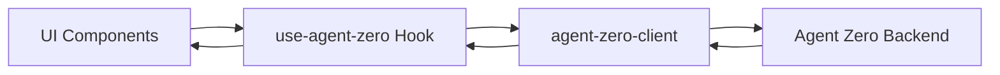

# Phase 2: UI/UX Enhancements for Agent Zero Integration

## Overview

Phase 2 focuses on enhancing the UI/UX of Lumina's chat interface while working with the existing Agent Zero backend. The backend integration (SSE streaming, WebSocket, API client) from Phase 1 is complete and working. This phase improves the visual presentation, user interactions, and chat features without modifying the backend integration.

**Timeline:** 2-3 weeks  
**Priority:** High - User experience improvements  
**Dependencies:** Phase 1 (Complete ✅), Agent Zero backend running  
**Backend:** Agent Zero (no changes - UI enhancements only)

---

## Current State Analysis

### ✅ Working (Phase 1)
- [`lib/agent-zero-client.ts`](../lib/agent-zero-client.ts) - Complete API client
- [`hooks/use-agent-zero.ts`](../hooks/use-agent-zero.ts) - Connection, chat, logs hooks
- [`types/agent-zero.ts`](../types/agent-zero.ts) - Full type definitions  
- SSE streaming via `subscribeToStream` (line 139)
- File attachment upload via base64 (line 204)
- Context management with lifetime hours
- Log processing (user, agent, tool_call, etc.)

### ⚠️ Needs Enhancement (Phase 2 Focus)
- **[`chat-panel.tsx`](../components/chat/chat-panel.tsx)** - Basic UI, needs advanced features
- **[`chat-message.tsx`](../components/chat/chat-message.tsx)** - Needs tool call visualization
- **[`code-block.tsx`](../components/chat/code-block.tsx)** - Needs syntax highlighting  
- **File Attachments** - Upload UI exists but no preview/download
- **Voice Input** - Button exists but not functional
- **Markdown** - Plain text only, no rich rendering
- **Message Management** - No edit, delete, search capabilities
- **Streaming UI** - Basic loading animation, needs better feedback

---

## Success Criteria

### Enhanced Chat Interface ✅
- Rich markdown rendering with GFM support
- Syntax-highlighted code blocks with copy button
- Tool call execution visualization
- Agent hierarchy display
- Streaming indicators per-agent
- Error state handling

### File Management ✅
- File attachment preview (images, PDFs)
- File download functionality
- Multiple file upload support
- File type icons and metadata
- Progress indicators

### Voice Features ✅
- Speech-to-text input (Web Speech API)
- Visual recording indicator
- Transcript preview before send
- Browser compatibility detection

### Message Features ✅
- Message editing (user messages only)
- Message deletion with confirmation
- Copy message content
- Full-text search across messages
- Message timestamps with relative time

### Supabase Persistence (Optional) ✅
- Save chat contexts to database
- Load previous conversations
- Share chats between devices
- Maintain Agent Zero context_id mapping

---

## Architecture Principles

### 1. Agent Zero First


**All backend communication uses existing Agent Zero integration.**

### 2. UI Layer Only
- No new API routes needed
- No changes to hooks/use-agent-zero.ts
- No modifications to lib/agent-zero-client.ts
- Enhancement of existing components only

### 3. Progressive Enhancement
- Core chat works without enhancements
- Features degrade gracefully (e.g., voice input if unsupported)
- Mobile-first responsive design
- Accessibility maintained (WCAG AA)

---

## Implementation Plan

### Week 1: Enhanced Markdown & Code Display

#### 1.1 Rich Markdown Rendering
Create `components/chat/markdown-renderer.tsx`:

```typescript
"use client"

import ReactMarkdown from 'react-markdown'
import remarkGfm from 'remark-gfm'
import rehypeHighlight from 'rehype-highlight'
import { CodeBlock } from './code-block-enhanced'

interface MarkdownRendererProps {
  content: string
}

export function MarkdownRenderer({ content }: MarkdownRendererProps) {
  return (
    <ReactMarkdown
      remarkPlugins={[remarkGfm]}
      rehypePlugins={[rehypeHighlight]}
      components={{
        code({ node, inline, className, children, ...props }) {
          const match = /language-(\w+)/.exec(className || '')
          const language = match ? match[1] : ''
          const code = String(children).replace(/\n$/, '')

          return !inline ? (
            <CodeBlock language={language} code={code} />
          ) : (
            <code className="px-1.5 py-0.5 rounded bg-muted font-mono text-sm">
              {children}
            </code>
          )
        },
        a({ children, href }) {
          return (
            <a 
              href={href} 
              target="_blank" 
              rel="noopener noreferrer"
              className="text-primary underline hover:no-underline"
            >
              {children}
            </a>
          )
        },
        table({ children }) {
          return (
            <div className="overflow-x-auto my-4">
              <table className="border-collapse border border-border w-full">
                {children}
              </table>
            </div>
          )
        },
        th({ children }) {
          return (
            <th className="border border-border px-4 py-2 bg-muted font-semibold text-left">
              {children}
            </th>
          )
        },
        td({ children }) {
          return (
            <td className="border border-border px-4 py-2">
              {children}
            </td>
          )
        },
      }}
    >
      {content}
    </ReactMarkdown>
  )
}
```

**Integration:** Update `chat-message.tsx` to use `<MarkdownRenderer content={message.content} />`

#### 1.2 Enhanced Code Block
Update `components/chat/code-block.tsx` with syntax highlighting:

```typescript
"use client"

import { useState } from 'react'
import { Prism as SyntaxHighlighter } from 'react-syntax-highlighter'
import { oneDark } from 'react-syntax-highlighter/dist/cjs/styles/prism'
import { Button } from '@/components/ui/button'
import { Copy, Check, Download } from 'lucide-react'
import { cn } from '@/lib/utils'

interface CodeBlockEnhancedProps {
  language: string
  code: string
  filename?: string
}

export function CodeBlock({ language, code, filename }: CodeBlockEnhancedProps) {
  const [copied, setCopied] = useState(false)

  const handleCopy = async () => {
    await navigator.clipboard.writeText(code)
    setCopied(true)
    setTimeout(() => setCopied(false), 2000)
  }

  const handleDownload = () => {
    const blob = new Blob([code], { type: 'text/plain' })
    const url = URL.createObjectURL(blob)
    const a = document.createElement('a')
    a.href = url
    a.download = filename || `code.${language}`
    a.click()
    URL.revokeObjectURL(url)
  }

  return (
    <div className="my-3 rounded-lg overflow-hidden border border-border/50 bg-[#282c34]">
      {/* Header */}
      <div className="flex items-center justify-between px-3 py-2 bg-muted/10 border-b border-border/30">
        <span className="text-xs font-mono text-muted-foreground">
          {filename || language}
        </span>
        <div className="flex items-center gap-1">
          <Button
            variant="ghost"
            size="icon"
            className="h-6 w-6 text-muted-foreground hover:text-foreground"
            onClick={handleCopy}
          >
            {copied ? <Check className="h-3 w-3" /> : <Copy className="h-3 w-3" />}
            <span className="sr-only">Copy code</span>
          </Button>
          <Button 
            variant="ghost" 
            size="icon" 
            className="h-6 w-6 text-muted-foreground hover:text-foreground"
            onClick={handleDownload}
          >
            <Download className="h-3 w-3" />
            <span className="sr-only">Download code</span>
          </Button>
        </div>
      </div>

      {/* Code with syntax highlighting */}
      <SyntaxHighlighter
        language={language}
        style={oneDark}
        customStyle={{
          margin: 0,
          padding: '1rem',
          fontSize: '0.8rem',
          lineHeight: '1.5',
          background: 'transparent',
        }}
        showLineNumbers
      >
        {code}
      </SyntaxHighlighter>
    </div>
  )
}
```

#### 1.3 Dependencies to Install
```bash
npm install react-markdown remark-gfm rehype-highlight
npm install react-syntax-highlighter @types/react-syntax-highlighter
npm install highlight.js  # For rehype-highlight
```

**Testing:** Create sample messages with markdown, tables, code blocks

---

### Week 2: Tool Call Visualization & Agent Hierarchy

#### 2.1 Tool Call Component
Create `components/chat/tool-call-display.tsx`:

```typescript
"use client"

import { useState } from 'react'
import type { ToolCall } from '@/types/agent-zero'
import { Button } from '@/components/ui/button'
import { Collapsible, CollapsibleContent, CollapsibleTrigger } from '@/components/ui/collapsible'
import { Badge } from '@/components/ui/badge'
import { ChevronDown, ChevronRight,  Terminal, CheckCircle2, XCircle, Loader2 } from 'lucide-react'
import { cn } from '@/lib/utils'

interface ToolCallDisplayProps {
  toolCalls: ToolCall[]
}

export function ToolCallDisplay({ toolCalls }: ToolCallDisplayProps) {
  const [expandedIds, setExpandedIds] = useState<Set<string>>(new Set())

  const toggleExpanded = (id: string) => {
    setExpandedIds(prev => {
      const next = new Set(prev)
      if (next.has(id)) {
        next.delete(id)
      } else {
        next.add(id)
      }
      return next
    })
  }

  const getStatusIcon = (status: ToolCall['status']) => {
    switch (status) {
      case 'completed':
        return <CheckCircle2 className="h-4 w-4 text-green-500" />
      case 'error':
        return <XCircle className="h-4 w-4 text-destructive" />
      case 'running':
        return <Loader2 className="h-4 w-4 animate-spin text-primary" />
      default:
        return <Terminal className="h-4 w-4 text-muted-foreground" />
    }
  }

  return (
    <div className="mt-3 space-y-2">
      {toolCalls.map((toolCall) => {
        const isExpanded = expandedIds.has(toolCall.id)
        
        return (
          <Collapsible
            key={toolCall.id}
            open={isExpanded}
            onOpenChange={() => toggleExpanded(toolCall.id)}
          >
            <div className="rounded-lg border border-border/50 bg-muted/30">
              <CollapsibleTrigger asChild>
                <Button
                  variant="ghost"
                  className="w-full justify-between px-3 py-2 h-auto"
                >
                  <div className="flex items-center gap-2">
                    {getStatusIcon(toolCall.status)}
                    <span className="font-mono text-sm">{toolCall.name}</span>
                    <Badge variant="outline" className="text-xs">
                      {toolCall.status}
                    </Badge>
                  </div>
                  {isExpanded ? (
                    <ChevronDown className="h-4 w-4" />
                  ) : (
                    <ChevronRight className="h-4 w-4" />
                  )}
                </Button>
              </CollapsibleTrigger>

              <CollapsibleContent>
                <div className="px-3 pb-3 space-y-2">
                  {/* Arguments */}
                  {Object.keys(toolCall.args).length > 0 && (
                    <div>
                      <div className="text-xs font-semibold text-muted-foreground mb-1">
                        Arguments:
                      </div>
                      <pre className="text-xs bg-background p-2 rounded border border-border overflow-x-auto">
                        {JSON.stringify(toolCall.args, null, 2)}
                      </pre>
                    </div>
                  )}

                  {/* Result */}
                  {toolCall.result && (
                    <div>
                      <div className="text-xs font-semibold text-muted-foreground mb-1">
                        Result:
                      </div>
                      <pre className="text-xs bg-background p-2 rounded border border-border overflow-x-auto max-h-32">
                        {toolCall.result}
                      </pre>
                    </div>
                  )}

                  {/* Timing */}
                  {toolCall.startTime && (
                    <div className="text-xs text-muted-foreground">
                      Execution time: {
                        toolCall.endTime 
                          ? `${Math.round((toolCall.endTime.getTime() - toolCall.startTime.getTime()) / 1000)}s`
                          : 'In progress...'
                      }
                    </div>
                  )}
                </div>
              </CollapsibleContent>
            </div>
          </Collapsible>
        )
      })}
    </div>
  )
}
```

#### 2.2 Agent Hierarchy Display
Create `components/chat/agent-hierarchy.tsx`:

```typescript
"use client"

import type { Agent } from '@/types/agent-zero'
import { Badge } from '@/components/ui/badge'
import { Bot } from 'lucide-react'
import { cn } from '@/lib/utils'

interface AgentHierarchyProps {
  agents: Agent[]
  activeAgentId?: string
}

export function AgentHierarchy({ agents, activeAgentId }: AgentHierarchyProps) {
  // Sort by level (0 is root, higher numbers are delegates)
  const sortedAgents = [...agents].sort((a, b) => a.level - b.level)

  const getStatusColor = (status: Agent['status']) => {
    switch (status) {
      case 'thinking': return 'bg-blue-500'
      case 'executing': return 'bg-primary'
      case 'delegating': return 'bg-purple-500'
      default: return 'bg-muted'
    }
  }

  return (
    <div className="flex items-center gap-1 overflow-x-auto py-1">
      {sortedAgents.map((agent, index) => (
        <div key={agent.id} className="flex items-center gap-1 shrink-0">
          {index > 0 && (
            <div className="text-muted-foreground text-xs">→</div>
          )}
          <Badge
            variant={agent.id === activeAgentId ? 'default' : 'outline'}
            className={cn(
              "flex items-center gap-1.5 px-2 py-1",
              agent.id === activeAgentId && "animate-pulse"
            )}
          >
            <div className={cn("w-2 h-2 rounded-full", getStatusColor(agent.status))} />
            <Bot className="h-3 w-3" />
            <span className="text-xs">{agent.name}</span>
            {agent.level > 0 && (
              <span className="text-xs text-muted-foreground">L{agent.level}</span>
            )}
          </Badge>
        </div>
      ))}
    </div>
  )
}
```

#### 2.3 Update ChatMessage Component
Modify `components/chat/chat-message.tsx` to include:
- Tool call visualization (if `message.toolCalls` exists)
- Agent hierarchy info in agent messages
- Markdown rendering instead of plain text

---

### Week 3: File Management & Voice Input

#### 3.1 File Attachment Components

Create `components/chat/file-attachment-preview.tsx`:

```typescript
"use client"

import { useState } from 'react'
import { Button } from '@/components/ui/button'
import { X, Download, FileText, Image as ImageIcon, File } from 'lucide-react'
import { cn } from '@/lib/utils'

interface FileAttachment {
  filename: string
  base64: string
  size?: number
  type?: string
}

interface FileAttachmentPreviewProps {
  attachments: FileAttachment[]
  onRemove?: (index: number) => void
  readonly?: boolean
}

export function FileAttachmentPreview({ 
  attachments, 
  onRemove,
  readonly = false 
}: FileAttachmentPreviewProps) {
  const getFileIcon = (filename: string) => {
    const ext = filename.split('.').pop()?.toLowerCase()
    
    if (['jpg', 'jpeg', 'png', 'gif', 'webp', 'svg'].includes(ext || '')) {
      return <ImageIcon className="h-4 w-4" />
    }
    if (['txt', 'md', 'json', 'xml'].includes(ext || '')) {
      return <FileText className="h-4 w-4" />
    }
    return <File className="h-4 w-4" />
  }

  const handleDownload = (attachment: FileAttachment) => {
    const blob = base64ToBlob(attachment.base64, attachment.type || 'application/octet-stream')
    const url = URL.createObjectURL(blob)
    const a = document.createElement('a')
    a.href = url
    a.download = attachment.filename
    a.click()
    URL.revokeObjectURL(url)
  }

  return (
    <div className="flex flex-wrap gap-2 mt-2">
      {attachments.map((attachment, index) => (
        <div
          key={index}
          className={cn(
            "flex items-center gap-2 px-3 py-2 rounded-lg border border-border",
            "bg-muted/30 hover:bg-muted/50 transition-colors"
          )}
        >
          {getFileIcon(attachment.filename)}
          <span className="text-sm truncate max-w-[200px]">
            {attachment.filename}
          </span>
          {attachment.size && (
            <span className="text-xs text-muted-foreground">
              ({formatFileSize(attachment.size)})
            </span>
          )}
          
          <div className="flex gap-1 ml-auto">
            <Button
              variant="ghost"
              size="icon"
              className="h-6 w-6"
              onClick={() => handleDownload(attachment)}
            >
              <Download className="h-3 w-3" />
              <span className="sr-only">Download</span>
            </Button>
            
            {!readonly && onRemove && (
              <Button
                variant="ghost"
                size="icon"
                className="h-6 w-6 hover:text-destructive"
                onClick={() => onRemove(index)}
              >
                <X className="h-3 w-3" />
                <span className="sr-only">Remove</span>
              </Button>
            )}
          </div>
        </div>
      ))}
    </div>
  )
}

function base64ToBlob(base64: string, mimeType: string): Blob {
  const byteCharacters = atob(base64)
  const byteArrays = []

  for (let i = 0; i < byteCharacters.length; i++) {
    byteArrays.push(byteCharacters.charCodeAt(i))
  }

  return new Blob([new Uint8Array(byteArrays)], { type: mimeType })
}

function formatFileSize(bytes: number): string {
  if (bytes < 1024) return `${bytes} B`
  if (bytes < 1024 * 1024) return `${(bytes / 1024).toFixed(1)} KB`
  return `${(bytes / (1024 * 1024)).toFixed(1)} MB`
}
```

#### 3.2 File Upload Enhancement
Update the file upload button in `chat-panel.tsx` to show previews before sending.

#### 3.3 Voice Input Component
Create `components/chat/voice-input.tsx`:

```typescript
"use client"

import { useState, useEffect, useRef } from 'react'
import { Button } from '@/components/ui/button'
import { Mic, MicOff, Send } from 'lucide-react'
import { cn } from '@/lib/utils'

interface VoiceInputProps {
  onTranscript: (text: string) => void
  className?: string
}

export function VoiceInput({ onTranscript, className }: VoiceInputProps) {
  const [isListening, setIsListening] = useState(false)
  const [isSupported, setIsSupported] = useState(false)
  const [transcript, setTranscript] = useState('')
  const recognitionRef = useRef<any>(null)

  useEffect(() => {
    const SpeechRecognition = 
      (window as any).SpeechRecognition || 
      (window as any).webkitSpeechRecognition

    if (SpeechRecognition) {
      setIsSupported(true)
      recognitionRef.current = new SpeechRecognition()
      recognitionRef.current.continuous = false
      recognitionRef.current.interimResults = true
      recognitionRef.current.lang = 'en-US'

      recognitionRef.current.onresult = (event: any) => {
        let interimTranscript = ''
        let finalTranscript = ''

        for (let i = event.resultIndex; i < event.results.length; i++) {
          const transcriptPiece = event.results[i][0].transcript
          if (event.results[i].isFinal) {
            finalTranscript += transcriptPiece
          } else {
            interimTranscript += transcriptPiece
          }
        }

        setTranscript(interimTranscript || finalTranscript)

        if (finalTranscript) {
          onTranscript(finalTranscript)
          setTranscript('')
          setIsListening(false)
        }
      }

      recognitionRef.current.onerror = (event: any) => {
        console.error('Speech recognition error:', event.error)
        setIsListening(false)
      }

      recognitionRef.current.onend = () => {
        setIsListening(false)
      }
    }

    return () => {
      if (recognitionRef.current) {
        recognitionRef.current.stop()
      }
    }
  }, [onTranscript])

  const toggleListening = () => {
    if (!isSupported) {
      alert('Speech recognition is not supported in your browser')
      return
    }

    if (isListening) {
      recognitionRef.current?.stop()
    } else {
      setTranscript('')
      recognitionRef.current?.start()
      setIsListening(true)
    }
  }

  if (!isSupported) {
    return null
  }

  return (
    <div className={className}>
      {transcript && (
        <div className="absolute bottom-full mb-2 left-0 right-0 bg-muted p-2 rounded-lg text-sm">
          {transcript}
        </div>
      )}
      <Button
        type="button"
        variant="ghost"
        size="icon"
        onClick={toggleListening}
        className={cn(
          "h-9 w-9",
          isListening && "text-destructive animate-pulse"
        )}
      >
        {isListening ? (
          <MicOff className="h-5 w-5" />
        ) : (
          <Mic className="h-5 w-5" />
        )}
        <span className="sr-only">
          {isListening ? 'Stop voice input' : 'Start voice input'}
        </span>
      </Button>
    </div>
  )
}
```

---

## Optional: Supabase Chat Persistence

### Database Schema

```sql
-- Chats table
CREATE TABLE chats (
  id UUID PRIMARY KEY DEFAULT gen_random_uuid(),
  user_id UUID NOT NULL REFERENCES auth.users(id) ON DELETE CASCADE,
  context_id TEXT UNIQUE NOT NULL, -- Agent Zero context_id
  title TEXT NOT NULL,
  created_at TIMESTAMPTZ DEFAULT NOW(),
  updated_at TIMESTAMPTZ DEFAULT NOW(),
  archived BOOLEAN DEFAULT FALSE,
  metadata JSONB DEFAULT '{}'::jsonb
);

-- Messages table (cache/backup of Agent Zero logs)
CREATE TABLE messages (
  id UUID PRIMARY KEY DEFAULT gen_random_uuid(),
  chat_id UUID NOT NULL REFERENCES chats(id) ON DELETE CASCADE,
  user_id UUID NOT NULL REFERENCES auth.users(id) ON DELETE CASCADE,
  log_id TEXT, -- Agent Zero log item ID
  role TEXT NOT NULL,
  content TEXT NOT NULL,
  created_at TIMESTAMPTZ DEFAULT NOW(),
  metadata JSONB DEFAULT '{}'::jsonb
);

-- Indexes
CREATE INDEX idx_chats_user_id ON chats(user_id);
CREATE INDEX idx_chats_context_id ON chats(context_id);
CREATE INDEX idx_messages_chat_id ON messages(chat_id);

-- RLS Policies
ALTER TABLE chats ENABLE ROW LEVEL SECURITY;
ALTER TABLE messages ENABLE ROW LEVEL SECURITY;

CREATE POLICY "Users can view their own chats"
  ON chats FOR SELECT
  USING (auth.uid() = user_id);

CREATE POLICY "Users can create their own chats"
  ON chats FOR INSERT
  WITH CHECK (auth.uid() = user_id);
```

### Hook for Persistence

```typescript
// hooks/use-chat-persistence.ts
"use client"

import { useCallback } from 'react'
import { createClient } from '@/lib/supabase'
import { useAuth } from './use-auth'

export function useChatPersistence() {
  const { user } = useAuth()
  const supabase = createClient()

  const saveChat = useCallback(async (contextId: string, title: string) => {
    if (!user) return null

    const { data, error } = await supabase
      .from('chats')
      .upsert({
        user_id: user.id,
        context_id: contextId,
        title,
        updated_at: new Date().toISOString(),
      }, {
        onConflict: 'context_id'
      })
      .select()
      .single()

    if (error) throw error
    return data
  }, [user, supabase])

  const loadChats = useCallback(async () => {
    if (!user) return []

    const { data, error } = await supabase
      .from('chats')
      .select('*')
      .eq('user_id', user.id)
      .eq('archived', false)
      .order('updated_at', { ascending: false })

    if (error) throw error
    return data
  }, [user, supabase])

  return { saveChat, loadChats }
}
```

---

## Dependencies Summary

```json
{
  "dependencies": {
    "react-markdown": "^9.0.0",
    "remark-gfm": "^4.0.0",
    "rehype-highlight": "^7.0.0",
    "react-syntax-highlighter": "^15.5.0",
    "highlight.js": "^11.9.0",
    "date-fns": "^4.1.0"
  },
  "devDependencies": {
    "@types/react-syntax-highlighter": "^15.5.11"
  }
}
```

**Note:** Most dependencies already exist (zustand, immer, @supabase/supabase-js)

---

## Testing Strategy

### Unit Tests
```typescript
// tests/unit/components/markdown-renderer.test.tsx
describe('MarkdownRenderer', () => {
  it('renders markdown with code blocks', () => {
    // Test markdown rendering
  })

  it('sanitizes dangerous HTML', () => {
    // Test XSS protection
  })
})

// tests/unit/components/tool-call-display.test.tsx
describe('ToolCallDisplay', () => {
  it('displays tool calls with status icons', () => {
    // Test tool call rendering
  })
})
```

### Integration Tests
```typescript
// tests/integration/chat-with-enhancements.test.tsx
describe('Enhanced Chat', () => {
  it('sends message with file attachments', async () => {
    // Test file upload flow
  })

  it('receives and renders markdown response', async () => {
    // Test markdown rendering in chat
  })
})
```

### E2E Tests
```typescript
// tests/e2e/chat-features.spec.ts
test('complete chat with enhancements', async ({ page }) => {
  // Login
  // Send markdown message
  // Upload file
  // Use voice input
  // Verify rendering
})
```

---

## Implementation Timeline

### Week 1: Markdown & Code (5 days)
- **Day 1-2:** Install dependencies, create MarkdownRenderer
- **Day 3-4:** Enhance CodeBlock with syntax highlighting
- **Day 5:** Integrate into ChatMessage, test thoroughly

### Week 2: Tools & Agents (5 days)
- **Day 1-2:** Create ToolCallDisplay component
- **Day 3:** Create AgentHierarchy component
- **Day 4:** Integrate into ChatMessage and ChatPanel
- **Day 5:** Testing and refinement

### Week 3: Files & Voice (5 days)
- **Day 1-2:** File attachment preview and management
- **Day 3:** Voice input component with Web Speech API
- **Day 4:** Integrate file upload UI into ChatPanel
- **Day 5:** Testing, accessibility, browser compatibility

### Optional: Supabase Persistence (+2-3 days)
- Database migration
- Persistence hook
- Chat history UI

---

## Success Metrics

### Visual Quality
- ✅ Code blocks have syntax highlighting
- ✅ Markdown tables render properly
- ✅ Links open in new tabs
- ✅ Tool calls are collapsible/expandable

### User Experience
- ✅ File attachments show previews
- ✅ Voice input works in supported browsers
- ✅ Agent hierarchy is visible during delegation
- ✅ Streaming responses have clear indicators

### Performance
- ✅ Markdown rendering <50ms per message
- ✅ Code highlighting doesn't block UI
- ✅ File uploads show progress
- ✅ Voice transcription <1s latency

### Accessibility
- ✅ All components keyboard navigable
- ✅ Screen reader announces tool call states
- ✅ Color contrast maintained
- ✅ ARIA labels on interactive elements

---

## Key Differences from Original Phase 2

| Aspect | Original Plan | Revised Plan |
|--------|--------------|--------------|
| Backend | Add AI SDK v4 | Keep Agent Zero only |
| API Routes | New /api/chat | None (use existing) |
| Hooks | New useChat | Use existing use-agent-zero |
| Database | Full chat storage | Optional persistence |
| Focus | New integration | UI/UX enhancements |
| Complexity | High (new backend) | Low (UI components) |
| Timeline | 4 weeks | 2-3 weeks |

---

## Migration Path

No migration needed - these are additive enhancements:

1. **Week 1:** Messages automatically render with markdown
2. **Week 2:** Tool calls automatically visualize (if present in message)
3. **Week 3:** File and voice features activate when used

All changes are **backward compatible** with current implementation.

---

## Next Steps

After Phase 2 completion:

### Phase 3 Options
1. **Agent Management Panel** - Better agent configuration UI
2. **Memory Visualization** - Show agent memory (MAIN, FRAGMENTS, etc.)
3. **Project Integration** - File tree, code editing
4. **Real-time Collaboration** - Multiple users in same chat
5. **Advanced Search** - Search across all chats and logs

---

## Conclusion

This revised Phase 2 focuses exclusively on improving the user experience of the existing Agent Zero integration. No backend changes are needed - all enhancements are pure UI/UX improvements that make the chat interface more powerful, user-friendly, and visually appealing.

**Ready to implement:** Yes ✅  
**Risk level:** Low 🟢  
**Estimated effort:** 2-3 weeks  
**Dependencies:** react-markdown, react-syntax-highlighter, highlight.js

---

*This plan respects the existing Agent Zero backend architecture and builds upon the solid foundation from Phase 1.*
